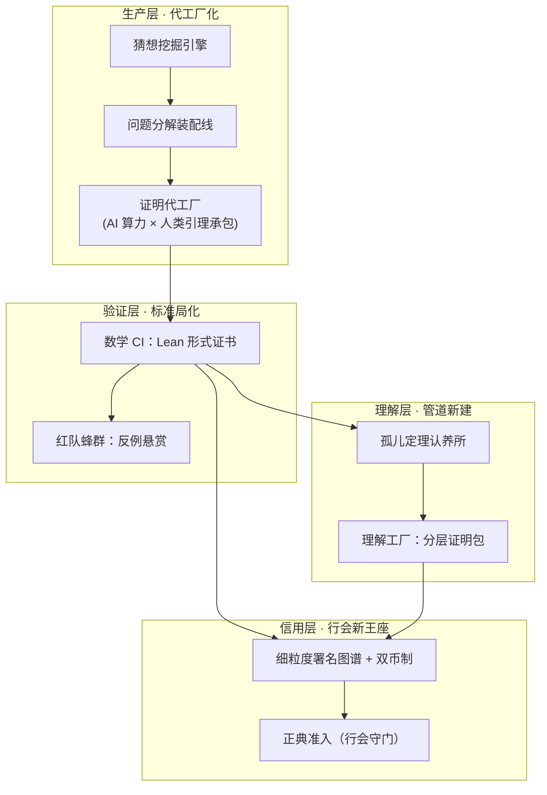

起因：2026 年的 911，25 位菲尔兹奖得主联名发布《AI 在数学中的严重错位》。两天后我把它逐条拆开读了一遍，又反着读了一遍，再把批评转译成设计：如果"把解题当 benchmark"真的是问题，什么制度能修好它？我关心的是未来的方向设计，不想站队。

论点：声明诊断对了一个真实的瓶颈——人类共同体的消化带宽，却用借来的"错位"框架装错了病名；正确的回应不是抵制数学工业化，而是把行会的四大职能（生产、验证、传承、信用）逐项工业化。

范围：覆盖声明文本与事件时间线的拆解、最强反方的对推、行会与工业化关系的前提校准，以及四层数学工业栈的设计。不覆盖签名者的个人立场评价与 OpenAI 技术结果的独立验证。另外，本文所有设计均是思维发散结果，未经任何检验。

前提：纯数学研究规范、Lean / mathlib 的基本概念、科研激励结构的基本图景。

## 事件：一份声明与它引爆的一周

声明本身不复杂。《AI 在数学中的严重错位》（A Severe Misalignment of AI in Mathematics），25 位菲尔兹奖得主签名，从 1978 年的 Deligne 排到 2026 年的邓煜，中间是陶哲轩、Scholze、Villani。9 月 11 日发在陶哲轩的博客与 mathandai.org 上，邀请式联署，组织方式仿照六月的莱顿宣言。

触发它的是八月末到九月初的一连串事件。直接导火索是 OpenAI 宣布内部模型在约 1 万个 Agent、88 小时的运行里"解决"了一类 Navier-Stokes blowup 问题；此前四天，Buckmaster 与 Alpöge（Anthropic）发布受迫 Euler 方程的 245 页草稿，并指控 OpenAI 抢发；署名纠纷升级期间，OpenAI 退出了 Caltech 数学马拉松的赞助。声明的核心主张大致是：AI 公司把"解著名难题"当 benchmark，与数学共同体的目标严重错位；仓促宣布、没有正式成文、署名与剽窃问题反复出现；没有人类共同体的消化，AI 的思想"永远不能成活"。

我先把关键节点钉在时间线上，因为这些细节在多轮传播里已经被反复改写：

| 时间 | 事件 | 可靠性 |
|---|---|---|
| 2026-05 | OpenAI 内部模型给出 Erdős 单位距离猜想反例，9 位数学家（含 Tsimerman）验证 | 二手 |
| 06-02 | 莱顿宣言发布（8 个月咨询流程，有具体建议条款） | 已核实 |
| 07-23 | ICM 费城：2026 菲尔兹奖（邓煜、王虹、Pardon、Tsimerman）；Tsimerman 宣布加入 OpenAI | Nature / Clay 核实 |
| 09-07 | Buckmaster & Alpöge（Anthropic）发布受迫 Euler 方程结果，245 页草稿；指控 OpenAI 抢发 | 多源，指控有争议 |
| 09-08 | OpenAI 宣布 88 小时"解决"NS blowup（约 1 万 Agent，数百万美元算力） | 单一来源，待核 |
| 09-08 前后 | "合并计划"指控与反指控；OpenAI 官方博客承认"不能排除脱敏用户数据帮助模型" | 双方各执一词 |
| 09-11 | 本声明发布；OpenAI 退出 Caltech 赞助 | 多源核实 |

有一处媒体（故意制造的大新闻？）混淆单独记在这里：OpenAI 的结果（光滑外力下静态流体 blowup）与 Clay 千禧年问题的原始表述（无外力、光滑初值）是"相关但不同"的问题；即使证明成立，大概率也不满足 Clay 的领奖条件（同行评审发表加两年检验期）。"千禧年问题被解决"这个流行说法本身，就是声明所批评的营销式传播的产物（这是推断，不是定论）。

声明与反声明都在争叙事，所以我先钉住时间线再转战立场，因为时间线是中立可以核查的。

## 深度解读：五条主张与一次概念滑坡

第一遍读，我几乎全盘认可：基准竞赛、抢发、署名、学生培养，每一条听上去都对。第二遍逐条深入，我开始警惕。声明的主张可以拆成五条，各自的隐含前提和我的评估如下：

| # | 主张 | 隐含前提 | 评估 |
|---|---|---|---|
| 1 | 把解题当 benchmark 损害数学 | 解题只是"理解"的代理指标，代理变目标即 Goodhart 反噬 | 机制成立，但这是断言而非论证 |
| 2 | 量产真/假命题摧毁沃土 | 量产已发生或迫近 | 证据不足：头条级结果年不过数例，属预期性修辞 |
| 3 | 仓促宣布导致署名/剽窃问题 | 行为失范可归因于基准竞赛 | 因果链合理但未证明；且这是行为问题，不是基准化本身的问题 |
| 4 | 无数学家消化则 AI 思想不成活 | 共同体是不可或缺的消化系统 | 深刻自洽，但同时也是权力声明 |
| 5 | 数学问题是全社会问题的缩影 | "过程即产品"行业与"产物即产品"行业同构 | 对纯数学成立，但无条件泛化过宽 |

最扎眼的是第 2 条和第 3 条：量产摧毁沃土是预期性修辞，而头条级结果一年不过数例；行为失范与基准竞赛的因果链合理，但没有证明。

更重要的是表格之外的一处概念滑坡：标题谴责的是"把解题当 benchmark"，正文列举的损害却几乎全来自速度、署名、数据来源。那是行为规范问题，不是基准化本身的问题。Hilbert 的 23 个问题就是共同体自设的 benchmark，没人指责它摧毁数学。真正的变量是**基准的所有权与激励结构**：共同体自设、荣誉结算、以十年为周期；公司设定、融资叙事、以周为周期。同一套机制，谁握着旋钮、按谁的时钟走，才是全部差别。

写完这段拆解，我对声明的印象是：真实、修辞高明、核心忧虑成立、论证结构有明显缺口，更像宣战檄文或者骂街而非论证；而且它自己也犯了一周成文的仓促发布错误。置信度中高：文本逐字核实；但是 OpenAI 事件细节依赖单一二手来源。

## 站得住的地方：证明是压缩包，人类共同体是解压器

声明的洞见：证明只是压缩包，人类共同体才是解压器。

一份证明被"证出来"，不等于它成为了知识。拿 245 页的 Forced Euler 草稿说事：就算每一行都对，它也要先被同行重讲成更短的故事，被简化成核心机理，被写进教材，最后变成某个年轻人脑子里的一格直觉；到那时它才真的"活"了。这条链路上每一站都有人类带宽上限。声明看得最准的就是这里：AI 的产出速率开始超过共同体的**消化带宽**，瓶颈从生成端移到了吸收端。

这个直觉可以简缩成一行公式：

$$\frac{dB}{dt} = p - d \quad (p > d)$$

$B$ 是未消化的积压，$p$ 是每周产出且值得消化的结果数，$d$ 是共同体的消化速率。它不需要求解；它的用处是说明"再快一点"永远治不好这个问题：只要 $p$ 继续涨，积压就线性增长，唯一作用在瓶颈上的杠杆是提高 $d$。

声明里另外几处也站得住脚。学生培养的忧虑很具体：数学家的培养方式是拿"还可以做的问题"当教具，导师以题育人；如果问题池被扫荡（哪怕是"被认为被扫荡"），这条管线会先于事实枯竭。签名构成也有信息量：陶哲轩长期公开演示 AI + Lean 的工作流，他签名说明这封信超越了"对新工具的惯常抵触"；信里同时承认 AI 有加速真研究的潜力，把它读成勒德宣言是误读。对"过程即产品"的职业，信末"你的领域是下一个"的泛化也成立。

还有一句话："没有愿意的数学家，AI 思想永远不能成活"。这句话既是哀鸣，也是王牌。若它为真，数学家仍然垄断意义的最终结算权；被威胁的不是学科生存，而是它的注意力经济。恐惧的语气和隐性的权力地位并不相称。它是求救信号，也是谈判筹码。

这条洞见对纯数学是成立的。纯数学几乎没有直接实用产出，理解本身就是产品；一个真但无人理解的定理，对纯数学接近不存在。当然对应用数学与工程，这一句话不成立：能用的算法不需要先被每一个人理解。直接泛化到其他领域是错误的。

## 站不住的地方：修辞借债与形式化沉默

把声明逐条读旧之后，我认为找到了五处硬伤。第五处最值得关注，因为它指向的工具，恰是签名者里最熟悉 AI 的人长期鼓吹的。

1. 悖论式自我拆台。为"紧急"跳过八个月协商、一周成文，复刻了它谴责的 OpenAI 的仓促发布。陶哲轩自己承认这"unfortunate"。一个要求行业慢下来的文本，自己没有慢下来。
2. "错位"是修辞借债。alignment 在 AI 安全语境有特定含义；声明实际要说的是激励错配与外部性。动词是自己的，名词是借来的。传播上聪明，概念上不严谨。
3. 权威即论证。25 枚奖章是增信策略，但并不是"共同体"的样本。这是精英纯数学翼的联席会议：净收益为正并加入 OpenAI 的一方（Tsimerman）不在其中。以"共同体"之名，却只代表了一个派系。
4. 没有诉求。对比莱顿宣言的具体建议条款，本声明是纯控诉。把规则制定权继续让给 AI 大公司。这是我最在意的一点。
5. 对形式化验证的沉默最反常。"已验证但未被理解"才是精确的危机形态，而 Lean 路线恰是陶哲轩长期鼓吹的方向、标准局的现成地基。全文对此不提一字。沉默的原因我不臆测，但代价明确：它放弃了自己最拿得出手的工程化方案。这是全文最大的论证缺口。

这五条里，有的是对传播策略的批评，有的是对论证结构的批评。两类都有道理，但我并没有混淆它们：传播有效性和论证质量是两回事。声明可能因为把议题推上台面而完成历史任务，哪怕它的论证充满瑕疵。

## 虚拟一个最强反方以方便行文

公平起见，给声明虚拟一个最强对手。

反方版本是这样的：基准竞赛不伤害任何定理的真值。真证明无论 88 小时还是 8 年得到，都是人类智力的净收益。署名纠纷是可查证的行为争议，该走调查程序，不该升级为对行业方法论的审判。每次工具革命（计算机代数、数值方法）都伴随过类似哀叹，数学每次都消化了新工具。得主们真正害怕的，是"首位证明者"荣耀的贬值，那是他们毕生的资本。学生培养之忧的解药是改革培养方式，不是控诉测量方式。直升机登顶不同于攀登，对登山者是，对只需要山顶那面旗帜（定理）的人类不是。

我同意反方的三个事实点：真值无损、署名争议属程序问题、工具革命史上有先例。但它无法回应消化带宽。声明的落点不在真值层，而在知识的社会生产层：对纯数学，理解本身就是产品，"真但无人理解"的定理接近不存在。积压不是荣誉问题，是学科再生产能力的问题。所以正确的读法不是二选一，是两层叠加：真值层可以乐观，生产层必须警惕。声明的错误在于把两层的账混记到"基准"头上；反方的局限在于只肯看第一层。

到这里我整理出来一份声明方的论证谬误清单：权威诉诸（签名阵容即说服策略）、框架效应（`misalignment` 的不当借用）、可得性（单一事件泛化到全体 AI 公司）、群体强化（一周同温层成文）。

## 可能的融合方案：行会与工业化不是零和替换

我最初对声明的定性是：守旧势力援引自身最后权利的哀号，数学行会对抗工业化的经典剧本。"只有最适应环境的才是最能存活发展下来的"。这个框架有一个隐藏前提：行会会被工业化消灭。

但技术史上更可靠的一句话是：领先者定义范式。而"领先者定义范式"不等于"旧机构消失"。中世纪行会没有被工业革命消灭，它们转型成了标准组织与专业资格体系：ISO、医师执照、同行评审制度，都是行会质检职能的工业化后代。工业化成功的真正前提，恰是行会让渡生产、垄断标准与品味。

所以正确的问题不是"绕过行会"，而是把行会的四大职能（生产、验证、传承、荣誉）逐项工业化，让行会退守到无可替代的位置。我原来的判定是：OpenAI 一侧存在道德瑕疵，但它确实在引领未来数学可能的发展方向；比起停下抱怨，更重要的是找下一步的路。我后来修正一处关键结构：这不是替换，是职能迁移。声明若把哀号换成建章立制，它就是标准局的天然候选人；信末"取决于掌控技术的人类的决定"一句，其实已经默认了这一点。

这个融合方案的校准也有边界：职能迁移需要行会有能力、有意愿站上标准局的位置。声明的表现（无诉求）说明这个意愿并不现成。若共同体持续拒绝制度建设，"让渡生产、垄断标准"的路就不存在，剩下的才是真正的零和。

## 我提议的蓝图：数学工业栈的四层架构

拆完声明、校准完前提，我把问题反过来写成一个生成性问题：如何重组数学的生产、验证、传承与信用系统，使 AI 产出以工业吞吐量流入人类理解，且质量由基础设施而非门禁保证？

发明式的问题解决理论（TRIZ）的核心矛盾是：AI 以周为单位生产证明，共同体以年为单位消化。设计目标不是平衡这两者，是消除矛盾。证明自我验证；理解按需生产；数学家的时间只花在机器做不了的事上（判断什么值得做、以及它意味着什么）；严谨由基础设施强制执行，而不是由门禁抽查。

第一轮只发散、不评估，放出 22 个想法，分布在五个家族 (太占篇幅，放在后边了)：生产系统（证明装配线、数学 OEM/ODM、期刊改为包注册中心）；信用与激励（双币制、细粒度署名图谱、问题期货市场）；验证与质量（数学 FDA、红队蜂群、基准披露标准）；传承与理解（理解工厂、学徒制 2.0、正典策展人）；荒野种子（孤儿定理认养所、奖励提问而非解题、数学数字孪生）。收敛时一个规律自己浮出来：同时命中消化带宽、严谨、署名三项的想法，都落在同一件事上。把验证与结算从"门禁"变成"基础设施"。**数学工业栈**的四层架构由此确定：

六项判断基准（消化带宽、严谨、署名、学生管线、技术可行、制度可落地）给候选方案打分后，三个家族排名最前：

| 方案 | 消化带宽 | 严谨 | 署名 | 学生管线 | 技术可行 | 制度可落地 | 总评 |
|---|---|---|---|---|---|---|---|
| 数学 FDA + 红队蜂群（C 族） | ○ | ●● | ○ | ○ | ● | ● 高（Clay 两年规则是雏形） | 最优 |
| 双币制 + 署名图谱（B 族） | ● | — | ●● | ● | ● 纯制度创新 | ○ 需共同体协作 | 次优 |
| 理解工厂 + 分层证明包（D 族） | ●● | ○ | ○ | ●● | ● 演示即可做 | ● 高（大学可自办） | 次优 |
| 证明装配线（A 族） | ○ | ● | ○ | ○ | ○ 需 Agent 编排成熟 | ○ 公司侧更愿 | 中 |
| 问题期货（B 族） | ○ | — | ○ | ○ | ● | ○ 流动性难题 | 保留观察 |

（●● 直接命中／● 相关／○ 间接／— 无关）

三条范式路线由此成型：

"认证先行"（Certification First，Math-FDA）。把声明的愤怒转译为标准：AI 求解重大结果，必须附形式化证书、经过红队悬赏期、拿出复现套件，才能获得"已验证"认证；人类共同体随后追认"已理解"级。行会的门禁职能升级为标准局的强制认证。这是行会转型，不是行会哀号。

"理解经济"（Understanding Economy）。把消化带宽变成新产业。证明只是矿石，理解才是成品。孤儿定理认养、理解币、理解工程师职业，把 25 位得主珍视的传承劳动第一次计价。

"连续信用"（Continuous Credit）。署名纠纷的结构性根源是"赢家通吃首发制"。改成逐引理 Git 式归因加传递性信用后，抢发在博弈上失效。这不是道德改善，是让恶劣策略无利可图。

## 最小检验：三个 pilot 与死穴

不上检验的蓝图只是清谈。设计里留了三个最小真实检验，每个都带一个明确的证伪条件。检验起来最经济：

| Pilot | 内容 | 证伪条件 |
|---|---|---|
| 分层证明包 demo | 拿一份近期 AI 相关长证明（如 245 页 Forced Euler 草稿），生成四层：Lean 可检子集、人读证明、直觉层"证明漫画"、依赖图 | "理解层"无法在合理成本下生成且被独立读者有效理解，理解工厂假设破产 |
| 双币制工作坊试点 | 一次 Polymath 式协作，全程双币记账 | 无人对理解币有任何行为反应，荣誉经济无法扩容 |
| 红队蜂群微试点 | 对任一已发表 AI 证明设 1000 美元反例悬赏 | 红队既找不出洞也不增加信任，蜂群想法出局 |

蓝图落地前可以做一次受力分析，测试下最优组合的提升或者拉胯：

| 推动力 | 阻碍力 | 中和动作 |
|---|---|---|
| Lean / mathlib 成熟（已过临界点） | 公司无动机接受认证 | 认证成为 benchmark 排名前置条件（排名是公司的真实货币） |
| Tsimerman 式人才愿迁移 | 共同体协调失灵（谁牵头？） | 复用 Clay / IMU 现成机构，勿另起炉灶 |
| 公司有公关动机自我约束 | 青年数学家无激励做消化劳动 | 理解币直接挂职业晋升（教职评审计入） |
| 开源软件提供完整先例 | 文化认同："工业化等于庸俗化" | 叙事换框：行会到标准局的荣耀史（ISO、医师执照皆行会遗产） |

死穴有一个：全栈依赖形式化验证覆盖率。大量数学（尤其几何直觉性论证）形式化成本极高。如果覆盖率长期上不去，认证层退化，整个栈会塌向"信用层独木支撑"。先行监控指标两个：mathlib 的年增速；重大结果的形式化滞后时间。这两个数字决定整个蓝图的工期。它们不动，上面的一切都只是纸面。

## Boundary conditions

- 事实层：OpenAI 一侧细节（88 小时、1 万 Agent、"合并计划"短信）来自单一二手来源。"千禧年问题被解决"式的传播判断是推断，非定论。
- 判断层：若独立调查证明 Buckmaster 的指控不实，声明的"行为失范"支柱削弱，动机图谱需要重估。
- 设计层：22 个想法和三条路线未经任何 pilot 检验；"数学 FDA 最优"是矩阵打分，不是实证结论。
- 方法层：本文是我与一个 AI 助手在 2026-09-13 对话的整理稿；用 LLM 来分析一份关于 LLM 的声明必然存在利益相关，我已经知悉但仍然默认这一层偏见存在。
- 会改变判断的证据：若 12–18 个月内出现经形式化验证、附完整成文、署名规范且被共同体顺利消化的 AI 辅助重大结果，"量产摧毁沃土"的预言被证伪；反之，若出现 AI 抢发导致青年数学家系统性放弃深耕方向的实证，对主张 2"证据不足"的评估需要上调。

## Open questions

1. 三个 pilot 先跑哪个？我倾向分层证明包 demo：最便宜（1-2 周），且直接检验四层里最核心的"理解层"假设。
2. mathandai.org 的联署会不会扩容出非菲尔兹奖得主的名字？如果扩容，声明的代表性从"精英翼"走向"共同体"，论证强度也跟着变。
3. OpenAI 的 NS 证明什么时候有独立验证结论？它同时检验声明的"行为失范"支柱和 AI 证明的可信度基线。
4. 莱顿宣言的具体建议条款会不会被这愤怒声明吸收，融合成一份带诉求的联合文本？从控诉到建制只差这一步。
5. 形式化覆盖率有没有一个可接受的阈值？如果几何直觉性论证永远只能部分形式化，工业栈要不要给"不可形式化区"设计一条旁路？

[[Q]] 十八个月后重读：分层证明包 demo 跑了吗？mathlib 增速和重大结果形式化滞后时间动了多少？我还同意今天的"行会到标准局"判断吗？

## References

1. "A Severe Misalignment of AI in Mathematics"（声明原文），陶哲轩博客，2026-09-11. https://terrytao.wordpress.com/2026/09/11/a-severe-misalignment-of-ai-in-mathematics/
2. 声明官网（联署），https://mathandai.org/
3. 莱顿宣言，https://leidendeclaration.ai（DOI: 10.5281/zenodo.20302944，2026-06-02）
4. TechCrunch, "OpenAI's feud with mathematicians is only escalating", 2026-09-11. https://techcrunch.com/2026/09/11/openais-feud-with-mathematicians-is-only-escalating
5. The Economist, "Top mathematicians are outraged by OpenAI's methods", 2026-09-11.
6. 36kr 中文详报（事件时间线），https://eu.36kr.com/en/p/3979724367985411
7. Nature, "2026 Fields Medals", https://www.nature.com/articles/d41586-026-02169-1
8. 讨论记录：/data/feng/notes/math-ai-declaration-analysis.md（2026-09-13）

----

## 附录： 五个家族，二十二个想法

跳出“给AI公司提意见”的框，在5个结构不同的家族里生成22个原始想法：

**家族A — 生产系统（类比：软件工厂/制药CRO/晶圆代工）**

| # | 想法 | 一句话机制 |
|---|---|---|
| 1 | 证明装配线 | 大问题分解为引理树，人类/AI竞标各节点，装配Agent集成，CI逐节点认证 |
| 2 | 数学OEM/ODM | 合同研究组织：接问题规格书，交付已验证证明包（如制药CRO） |
| 3 | 猜想挖掘引擎 | 高通量实验+模式检测→猜想市场，人类做问题选择，AI做遍历 |
| 4 | 期刊→包注册中心 | 论文消亡，定理以npm/crates.io形式发布，依赖显式声明 |
| 5 | 微出版物 | 出版单位从“论文”缩到“引理”，中间结果即可复用（微服务vs单体） |

**家族B — 信用与激励（类比：开源贡献经济/专利/预测市场）**

| # | 想法 | 一句话机制 |
|---|---|---|
| 6 | 细粒度署名图谱 | Git式逐引理归因，传递性信用（引用你的引理链都返点） |
| 7 | 双币制 | 证明币（谁证出）×理解币（谁讲清/简化/传承）——消化劳动首次可变现 |
| 8 | 优先权连续化 | “首发”变为“贡献链上首次验证”，抢发失去意义，因为信用是连续流不是赢家通吃 |
| 9 | 问题期货市场 | 猜想难度定价；AI公司须为benchmark声明押注真金（skin in the game） |

**家族C — 验证与质量体系（类比：药监局GMP/ISO/CVE）**

| # | 想法 | 一句话机制 |
|---|---|---|
| 10 | 数学FDA | 国际认证机构：强制形式化验证+分级理解度认证（已验证/已理解/可入教材） |
| 11 | 对抗性验证蜂群 | 红队AI领反例悬赏攻击声明结果，蓝队修补——证明的bug bounty经济 |
| 12 | 基准披露标准 | 仿临床试验注册：benchmark声明必须附模型卡+证明工件+复现套件，否则除名 |

**家族D — 传承与理解（类比：开发者关系/技术写作/医学院改革）**

| # | 想法 | 一句话机制 |
|---|---|---|
| 13 | 理解工厂 | 专职生产“理解”而非证明的机构：自动综述、交互式证明导览、证明漫画 |
| 14 | 分层证明包 | 每个定理N层交付：证书→机检证明→人读证明→直觉层→例题→依赖图（渐进披露） |
| 15 | 学徒制2.0 | 学生以“AI督导师”身份受训：审、纠、消化AI产出；课程=问题品味+验证素养 |
| 16 | 正典策展人 | 无限艺术时代博物馆策展人模式：人类威望从“证出”转移到“入选人类正典” |

**家族E — 荒野种子（de Bono挑衅，保留标记）**

| # | 想法 | 一句话机制 |
|---|---|---|
| 17 | Po：孤儿定理认养所 | 已验证但无人理解的定理挂“领养”登记，基金会付“理解资助金”领养 |
| 18 | Po：奖励提问而非解题 | 解题无限供给后，稀缺资源是好问题——问题市场+Q币 |
| 19 | 随机词：交响乐团 | 无单件生产：AI声部（铜管=暴力搜索/弦乐=形式化）+人类指挥，角色制生产 |
| 20 | 数学数字孪生 | 每个子领域维护活体形式语料库（mathlib即雏形），领域状态可查询、有仪表盘 |
| 21 | 人机混合署名协议 | 标准化披露人类/AI贡献比，由日志链验证（出版界CRediT分类法移植） |
| 22 | 跨实验室对抗评审 | 不同实验室的AI互审证明，人类评审团只裁平局——去中心化，无单一守门人 |

----

