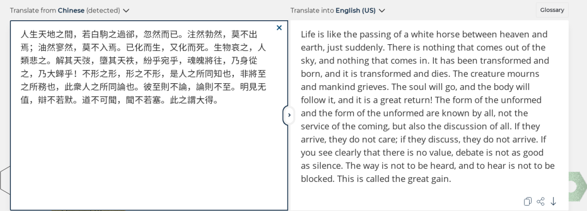

# <!--fit--> Solving inverse problems with deep convolutional neural networks
Feng Wang · Empa
12/27/2020

http://fengwang.github.io/siv/

---

## Deep learning for inverse problems

**Inverse problems**
- are some of the most important mathematical problems, but are
- usually solved by different application-specific applications.

**Deep learning**
- has shown great potential in problems across different domains,
- but is difficult to train due to their inner nonlinearity.

---

## Applications classified by dateset translation

+ 1D
  + sound waves, texts ...
+ 2D
  + images
+ 3D
  + movies
  + voxels

---

## Example application: 1D => 1D

Machine translation of one paragraph in 庄子-知北游.

----

## Example application: 1D => 2D

Image generation from text.

----

## Example application: 2D => 3D

----

## Eample application: 3D => 3D

So you think you can dance?

----

Well .... Yes!

----

##  <!--fit-->  MCNN: Multi-resolution convolutional neural networks

http://fengwang.github.io/mdcnn

---

## <!--fit--> Noise2Atom: Unsupervised Denoising

http://fengwang.github.io/noise2atom/

---

http://fengwang.github.io/noise2atom/

---

## Take-home message

- An application-neutral framework for solving inverse problems that involve image to image mappings
  - without being limited to specific applications,
  - but relying on massive datasets
- Application can be supervised/un-supervised.
- Paradigm shift: data-intensive scientific discovery.

---

## Thanks and Questions?

